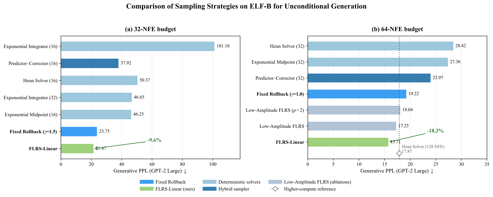
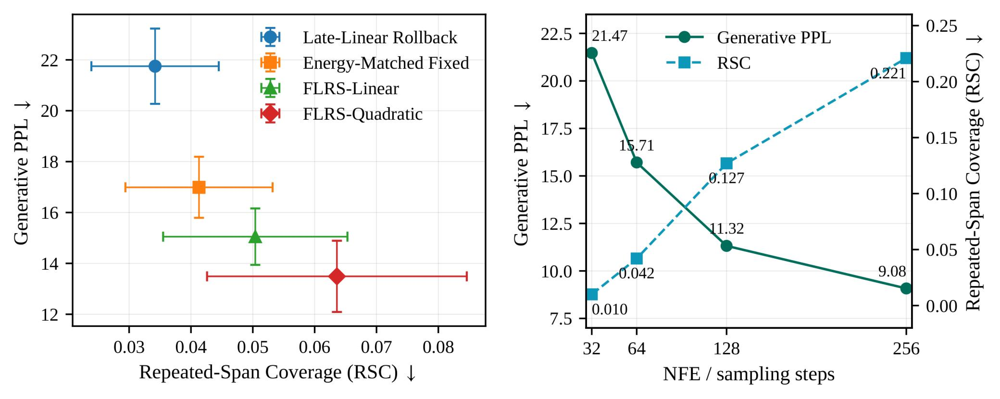

<div align="center">

# FLRS: Front-Loaded Rollback Sampling for ELF

### Allocate rollback strength where it matters most.

[](https://www.python.org/)
[](https://pytorch.org/)
[](#overview)
[](#reproducing-the-main-comparisons)
[](LICENSE)

[Overview](#overview) ·
[Results](#results) ·
[Installation](#install) ·
[Quick Start](#quick-start) ·
[Reproduction](#reproducing-the-main-comparisons) ·
[Code Map](#code-map)

</div>

---

## Overview

> **TL;DR:** FLRS requires no training, no checkpoint modification, and no
> additional network evaluations, while improving generative PPL by
> **9.6% at 32 NFE** and **18.3% at 64 NFE** over fixed rollback on ELF-B.

This repository contains the PyTorch implementation and evaluation code for
**Front-Loaded Rollback Sampling (FLRS)**.

FLRS keeps the ELF checkpoint, time grid, decoder, and number of network
evaluations fixed. The only change is the temporal schedule of the native
rollback operator:  **same model · same compute · better rollback allocation**


The rollback coefficient jointly controls time rollback, deterministic
contraction, and Gaussian injection. It should therefore be interpreted as a
schedule over the complete native rollback transition, rather than as an
isolated post-hoc noise scale.

<a id="results"></a>

## Results at a glance

<p align="center">
  <sub>Generative PPL on ELF-B using GPT-2 Large. Lower is better.</sub>
</p>

<p align="center">
  
</p>

<p align="center">
  <sub>
    Comparison under matched 32- and 64-NFE budgets.
    FLRS changes only the rollback-strength schedule.
  </sub>
</p>

### Rollback schedule comparison

| Schedule | Amplitude A | PPL ↓ | Entropy ↑ | RSC ↓ | RI (%) ↓ |
|:--|--:|--:|--:|--:|--:|
| Fixed Reference | 1.000 | 18.55 ± 1.39 | 5.07 ± 0.04 | 0.0373 ± 0.0116 | 79.3 |
| Late-Linear Rollback | 3.419 ± 0.628 | 21.75 ± 1.48 | **5.10 ± 0.03** | **0.0342 ± 0.0103** | **73.3** |
| Energy-Matched Fixed | 1.319 ± 0.118 | 16.99 ± 1.20 | 5.04 ± 0.04 | 0.0413 ± 0.0119 | 83.4 |
| FLRS-Linear | **2.000** | 15.05 ± 1.11 | 4.99 ± 0.04 | 0.0504 ± 0.0149 | 88.1 |
| FLRS-Quadratic | 2.719 ± 0.244 | **13.49 ± 1.40** | 4.94 ± 0.05 | 0.0636 ± 0.0210 | 91.7 |

<p align="center">
  <sub>
    Comparison of rollback schedules on ELF-B. Values are reported as
    mean ± standard deviation where applicable. Arrows indicate the preferred
    direction of each metric.
  </sub>
</p>

<a id="install"></a>

## Installation

```bash
conda create -n flrs python=3.10 -y
conda activate flrs
pip install -r requirements.txt
```

The code builds on the official
[ELF implementation](https://github.com/lillian039/ELF) and uses its released
checkpoints. For example, `embedded-language-flows/ELF-B-owt-torch` is loaded
automatically when supplied as `--checkpoint_path`.

## Quick start

Run FLRS on the ELF-B OpenWebText checkpoint:

```bash
NGPU=1 bash scripts/launch.sh eval \
    src/configs/training_configs/train_owt_ELF-B.yml \
    --checkpoint_path embedded-language-flows/ELF-B-owt-torch \
    --seeds 42 \
    --config_override \
      "sampling_configs_path=src/configs/sampling_configs/flrs_sampling_configs.yml" \
    --config_override use_bf16=true \
    --config_override use_compile=true
```

The default paper configuration is represented as:

```yaml
- sampling_method: flrs
  num_sampling_steps: [64]
  cfgs: [1]
  self_cond_cfg_scales: [3]
  rollback_gamma_start: 2.0
  rollback_gamma_end: 0.0
  rollback_power: 1.0
  time_schedule: logit_normal
```

The schedule is

```text
gamma(t) = gamma_end + (gamma_start - gamma_end) * (1 - t)^p.
```

`rollback_power: 1` gives FLRS-Linear and `rollback_power: 2` gives
FLRS-Quadratic.

## Reproducing the main comparisons

- Cross-model unconditional evaluation:
  `scripts/eval_elf_b.sh`, `scripts/eval_elf_m.sh`, and
  `scripts/eval_elf_l.sh`. These use five ELF-B seeds, three ELF-M/L seeds,
  and reset the RNG before each sampler.
- WMT14 German-to-English:
  `src/configs/sampling_configs/wmt_sampling_configs.yml`
- XSum:
  `src/configs/sampling_configs/xsum_sampling_configs.yml`
- Energy-matched allocation:

```bash
python scripts/run_energy_matched_experiment.py \
    --config src/configs/training_configs/train_owt_ELF-B.yml \
    --checkpoint embedded-language-flows/ELF-B-owt-torch \
    --nfe 64 \
    --seeds 41,42,43,44,45 \
    --num_samples 1000 \
    --output_dir outputs/energy_matched
```

Use `--dry_run` first to verify the matched direct-injection budgets without
loading the model.

For multi-stage diagnostic controls, paper labels denote prescribed NFE
budgets. The terminal one-call interval gives 31/63 actual calls for
two-stage 16/32-step controls and 46 for the three-round 16-step control.

Compute the paper's repetition diagnostics from generated JSONL:

```bash
python scripts/compute_repetition_metrics.py \
    --input outputs/<run>/all_generated_<epoch>_<step>.jsonl
```

The script reports repetition incidence (RI) and repeated-window coverage
(RSC) using the shared event "a 5-gram occurs at least three times."

<p align="center">
  
</p>

<p align="center">
  <sub>
    Quality–repetition trade-off on ELF-B. Left: comparison of rollback
    schedules under matched compute. Right: generative PPL and repeated-span
    coverage as the sampling budget increases. Lower is better for both
    generative PPL and RSC.
  </sub>
</p>

Summarize one model's paired runs with:

```bash
python scripts/summarize_cross_model.py \
    --input outputs/elf_b-cross_model \
    --model ELF-B
```

For human evaluation, fill the anonymized item-level schema documented in
`human_eval/README.md`, then recompute vote percentages and Fleiss' kappa:

```bash
python scripts/evaluate_human_preferences.py \
    --input human_eval/annotations.csv \
    --output human_eval/summary.json
```

## Code map

- `src/utils/generation_utils.py`: sampler dispatch and FLRS schedule
- `src/utils/sampling_utils.py`: native ELF rollback-and-advance update
- `src/utils/schedule_utils.py`: energy-matched schedule utilities
- `src/configs/sampling_configs/`: paper and diagnostic configurations
- `scripts/run_energy_matched_experiment.py`: paired, shared-noise experiment
- `scripts/compute_repetition_metrics.py`: RSC and RI implementation
- `scripts/evaluate_human_preferences.py`: human votes and Fleiss' kappa
- `scripts/summarize_cross_model.py`: cross-seed mean and SD

## Naming and compatibility

The public method identifier is `flrs`, with parameters
`rollback_gamma_start`, `rollback_gamma_end`, and `rollback_power`. Code from
early experiments may use `sde_anneal`, `sde_gamma`, `sde_gamma_end`, and
`sde_anneal_power`; these names remain accepted only as legacy input aliases.
New output directories and configurations always use the FLRS terminology.

## Scope and transferability

> [IMPORTANT]
> **This implementation is not directly compatible with arbitrary model
> families.** FLRS is tightly coupled to ELF's native rollback operator.
> Copying the current sampler into a model that does not provide an analogous
> operator will not work without additional algorithmic design.

FLRS separates into two levels:

- **Transferable principle:** allocate a stronger rollback intervention during
  the early stages of sampling and gradually reduce it toward the end.
- **ELF-specific implementation:** realize this schedule through ELF's native
  rollback-and-advance transition, which jointly controls time rollback,
  deterministic contraction, and Gaussian injection.

To apply the temporal-allocation principle to another model family, one must:

1. **Define a compatible transition.** The target model needs a newly designed
   rollback, correction, or perturbation operator that specifies how its state
   evolves under the scheduled intervention.
2. **Integrate the schedule into the sampler.** The intervention strength must
   be mapped to the target model's sampling dynamics; the ELF implementation
   cannot simply be copied unchanged.
3. **Perform compute-matched validation.** Comparisons must use equivalent
   computational budgets—such as matched network function evaluations
   (NFEs)—to distinguish gains from temporal allocation from gains caused by
   additional computation.


## License

This code is released under the [MIT License](LICENSE).

The repository is derived from the MIT-licensed ELF PyTorch implementation.
The original ELF portions retain their upstream copyright notice; the FLRS
implementation and accompanying experiment code are modifications released
under the same license.
