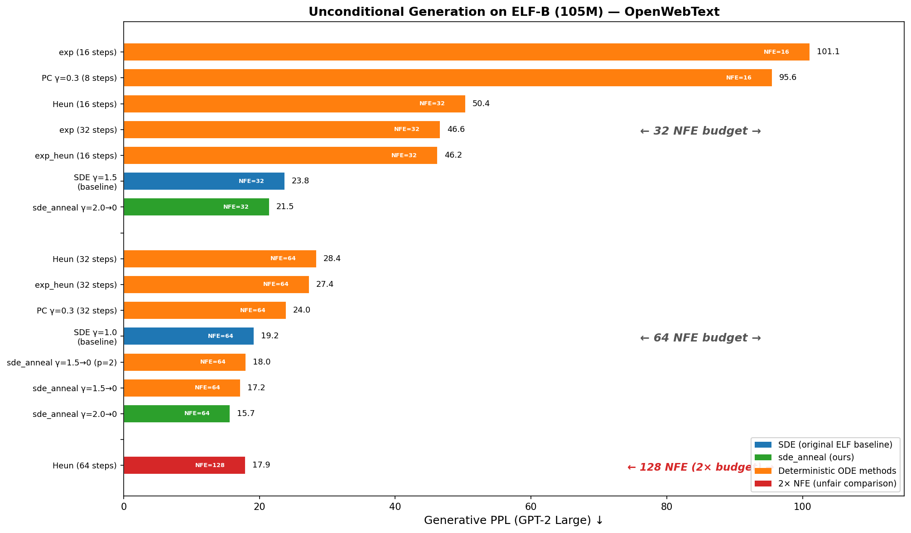
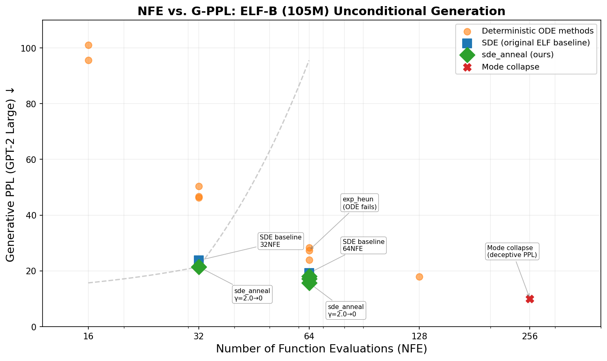

# SDE Annealing: Optimal Sampling for Flow-Matching Language Models

A fork of the official [ELF](https://github.com/lillian039/ELF) PyTorch implementation that introduces **SDE Annealing** — a time-dependent noise schedule for the reverse SDE sampler that reduces generative perplexity by **7–18%** across three model scales (105M–652M) at equal compute.





---

## SDE Annealing

### The Problem

Flow Matching language models like ELF sample text by integrating a reverse SDE. The standard approach uses **constant noise injection** ($\gamma = 1.0$–$1.5$) throughout every step. This is suboptimal because:

- At **early timesteps** ($t \approx 0$), the velocity field $v(z,t) = (\hat{x}_0 - z)/(1-t)$ is smooth — noise is harmless and promotes multi-modal exploration.
- At **late timesteps** ($t \to 1$), the $1/(1-t)$ singularity amplifies residual noise — the same noise that helps early on now corrupts convergence quality.

### The Method

Replace the constant $\gamma$ with a **time-dependent annealing schedule**:

$$\gamma(t) = \gamma_{\text{start}} \cdot (1-t)^p$$

- $\gamma_{\text{start}} = 2.0$, $\gamma_{\text{end}} = 0$, $p = 1$ (linear decay)
- The total noise budget $\int_0^1 \gamma(t)dt = 1.0$ — **identical** to constant SDE with $\gamma = 1.0$
- This is a **pure reallocation**: same total noise, deployed where it helps (early) and removed where it hurts (late)
- The final step uses exact exponential integration ($z(1) = \hat{x}_0$), eliminating the singular term entirely

### The Results

**Unconditional generation** (GPT-2 Large PPL, ELF-B 105M):

| Method | Steps | NFE | PPL ↓ | Entropy ↑ |
|--------|-------|-----|-------|-----------|
| SDE γ=1.5 (original baseline) | 32 | 32 | 23.75 | 5.15 |
| **SDE Annealing** | **32** | **32** | **21.47** | 5.10 |
| SDE γ=1.0 (original baseline) | 64 | 64 | 19.22 | 5.08 |
| **SDE Annealing** | **64** | **64** | **15.71** | 5.01 |

**Cross-model** (64 NFE, unconditional):

| Model | Params | Epochs | SDE PPL | Anneal PPL | Δ% |
|-------|--------|--------|---------|------------|-----|
| ELF-B | 105M | 5 | 19.22 | **15.71** | **−18.3%** |
| ELF-M | 342M | 4 | 21.52 | **18.76** | −12.8% |
| ELF-L | 652M | 3 | 23.88 | **22.13** | −7.3% |

**Conditional generation** (ELF-B):

| Task | Method | NFE | Metric | vs baseline |
|------|--------|-----|--------|-------------|
| WMT14 De-En | SDE Annealing 32-step | 32 | BLEU **26.62** | +3.5% vs ODE 64-step, **2.6× faster** |
| XSum | SDE Annealing 32-step | 32 | ROUGE-L **27.77** | 98% of ODE 64-step quality, **2× faster** |

### Why It Works

A step-wise noise decomposition (see [THEORY.md](THEORY.md)) reveals two noise terms in the ELF update:

1. **Direct injection noise** $W^{(1)}_k = O(\gamma_k h_k)$ — provides the diversity benefit
2. **Jacobian-amplified noise** $W^{(2)}_k = O(\gamma_k h_k^2 / (1-t_k))$ — contains a $1/(1-t)$ singularity

Linear annealing $\gamma(t) \propto (1-t)$ exactly cancels the singularity in $W^{(2)}_k$, while the decay factor in $W^{(1)}_k$ naturally suppresses direct noise at $t \to 1$. The result: clean convergence without the late-stage noise that plagues constant-$\gamma$ SDE samplers.

---

## What We Studied

We benchmarked **12 sampling methods** across 40+ configurations on the ELF architecture, controlling for NFE, seed, and model checkpoint. The full experimental report: [EXPERIMENTS.md](EXPERIMENTS.md).

| Category | Methods | Verdict |
|----------|---------|---------|
| Deterministic ODE | Euler, Heun (RK2), exponential integrator, exp-Heun | All < SDE at equal NFE |
| SDE variants | Constant-γ, Predictor-Corrector, Multi-Langevin, SDE-Exp hybrid | Constant-γ is the strong baseline |
| **SDE Annealing** (ours) | γ=2.0→0, linear & quadratic, 32/64/128/256 steps | **Best at 32–64 steps** |
| Adaptive step size | Heun + free error estimate, tolerance sweep | Improves PPL but entropy drops |
| Decoder interventions | Temperature, repetition penalty, latent/sc noise | None recover collapsed latents |

**Key findings:**

1. SDE noise is the dominant quality driver — no ODE solver matches constant-noise SDE at equal NFE
2. SDE Annealing is a **pure budget reallocation** (same ∫γ, different placement), not "adding more noise"
3. Optimal step count $N^* \approx 40$–$80$ — fewer steps under-integrate, more steps dilute noise and cause mode collapse
4. Mode collapse happens in the latent space — token-level post-processing cannot fix it
5. Gains scale with training quality (ELF-B 5 epochs: −18.3% > ELF-L 3 epochs: −7.3%)

---

## Usage

For installation, pretrained checkpoints, and baseline evaluation, see the [official ELF README](https://github.com/lillian039/ELF).

### Run SDE Annealing

Add `--config_override "sampling_configs_path=sde_anneal_sampling_configs.yml"` to any eval command:

```bash
# Unconditional generation (recommended: 64-step, PPL 15.71)
NGPU=8 bash scripts/launch.sh eval src/configs/training_configs/train_owt_ELF-B.yml \
    --checkpoint_path embedded-language-flows/ELF-B-owt-torch \
    --seeds 42 \
    --config_override "sampling_configs_path=sde_anneal_sampling_configs.yml" \
    --config_override use_bf16=true \
    --config_override use_compile=true

# Translation (recommended: 32-step, BLEU 26.62, 2.6× faster than ODE 64)
NGPU=8 MASTER_PORT=29503 bash scripts/launch.sh eval \
    src/configs/training_configs/train_de-en_ELF-B.yml \
    --checkpoint_path embedded-language-flows/ELF-B-de-en-torch \
    --seeds 42 \
    --config_override "sampling_configs_path=wmt_sampling_configs.yml" \
    --config_override use_bf16=true --config_override use_compile=true

# Summarization (recommended: 32-step, 2× faster, 98% quality)
NGPU=8 MASTER_PORT=29502 bash scripts/launch.sh eval \
    src/configs/training_configs/train_xsum_ELF-B.yml \
    --checkpoint_path embedded-language-flows/ELF-B-xsum-torch \
    --seeds 42 \
    --config_override "sampling_configs_path=xsum_sampling_configs.yml" \
    --config_override use_bf16=true --config_override use_compile=true
```

### Recommended YAML

```yaml
# Unconditional — best quality
- sampling_method: sde_anneal
  num_sampling_steps: [64]
  sde_gamma: 2.0
  sde_gamma_end: 0.0
  time_schedule: logit_normal

# Unconditional — compute-efficient
- sampling_method: sde_anneal
  num_sampling_steps: [32]
  sde_gamma: 2.0
  sde_gamma_end: 0.0
  time_schedule: logit_normal

# Translation — faster and better than baseline
- sampling_method: sde_anneal
  num_sampling_steps: [32]
  cfgs: [2]
  self_cond_cfg_scales: [1]
  sde_gamma: 2.0
  sde_gamma_end: 0.0
  time_schedule: logit_normal
```

---

## All Sampling Configs

| Config file | Method(s) |
|-------------|-----------|
| **`sde_anneal_sampling_configs.yml`** | **SDE Annealing** — γ=2.0→0, 32/64/128/256 steps |
| `exp_128step_anneal.yml` | SDE Annealing — 128-step γ sweep from 0 to 2.0 |
| `uncond_sampling_configs.yml` | SDE (original baseline) |
| `cond_sampling_configs.yml` | ODE (original conditional baseline) |
| `heun_sampling_configs.yml` | Heun (2nd-order RK) |
| `heun_uncond_sampling_configs.yml` | Heun unconditional variant |
| `exp_heun_sampling_configs.yml` | Exponential integrator, exp-Heun |
| `pc_sampling_configs.yml` | Predictor-Corrector |
| `sde_exp_sampling_configs.yml` | SDE-Exp hybrid |
| `heun_adaptive_sampling_configs.yml` | Adaptive Heun + decoding constraints |
| `sde_ml_sampling_configs.yml` | Multi-Langevin SDE |
| `sc_noise_sampling_configs.yml` | Self-conditioning noise (ineffective) |
| `z_noise_sampling_configs.yml` | z-space noise (ineffective) |
| `xsum_sampling_configs.yml` | XSum: ODE, SDE, SDE Annealing |
| `xsum_fast.yml` | XSum: SDE Annealing 16/32-step |
| `xsum_deterministic.yml` | XSum: Heun, exp |
| `wmt_sampling_configs.yml` | WMT: ODE, SDE Annealing |
| `elf_l_sampling_configs.yml` | ELF-L cross-model validation |

---

## Documentation

- **[EXPERIMENTS.md](EXPERIMENTS.md)** — Full experimental report: 12 methods, 40+ configs, per-method analysis, cross-model validation, conditional generation, autoregressive baselines, collapse metrics
- **[THEORY.md](THEORY.md)** — Step-wise noise decomposition, SNR analysis, optimal step count derivation, annealing protocol proofs, connection to DPM-Solver and EDM
- **[CODE_CHANGES.md](CODE_CHANGES.md)** — What was changed, why, and a step-by-step guide to adding new sampling methods

---

## License

See [LICENSE](LICENSE).
